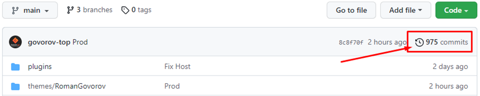

## Если что-то пошло не так, и необходимо вернуться к определённому коммиту:

#### 1) В проекте нажимаем на commits, или если в терминале, команда git log:

#### 1) Выбираем нужный нам коммит и копируем его название либо его хэш.

#### 2) Получаем данный коммит в состоянии HEAD, это значит что коммит сейчас без ветки, и ему нужно её создать:
`git checkout <название | хеш коммита>`

#### 3) Создаём новую ветку и закидываем туда нужный коммит:
`git branch <название_новой_ветки> <название | хеш коммита>`

#### 4) Переходим в новую ветку, чтобы убедиться что в ней нужные нам данные:
`git checkout <название_новой_ветки>`

#### 5) Переходим в основную ветку, куда нужно вернуть коммит:
`git checkout main`

#### 6) Перезаписываем данные с <название_новой_ветки>:
`git reset --hard <название_новой_ветки>`

#### 7) Принудительно возвращаем изменения в центральный репозиторий:
`git push --force origin main`